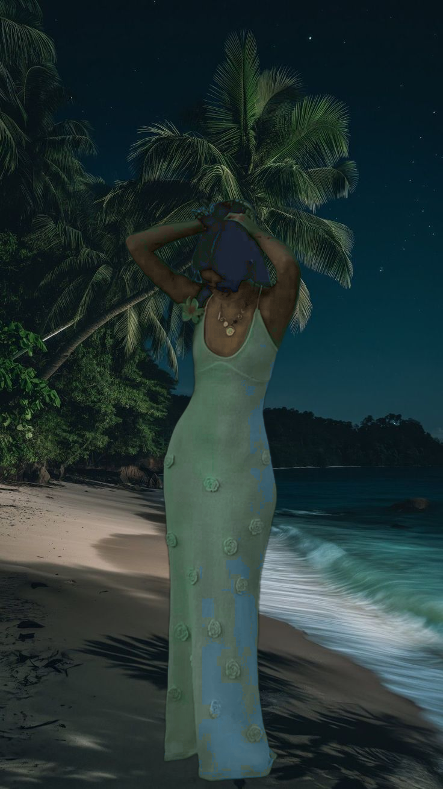

# Seamlessly Integrating a Person into a Scene

## Objective

The aim of this project was to insert a person into a background image in a way that looks as natural and realistic as possible. This involved matching lighting, color tone, shadows, and edges so that the final image blends seamlessly.

Although some steps were given, several had to be extended or rethought to achieve a convincing final result.

---

## Summary of Approach

### Task 1: Capturing and Preparing the Person's Image

**Image Capture**  
Using OpenCV, I captured a high-resolution image from the webcam. The subject was positioned in even lighting with a neutral background.

**Background Removal**  
I used the `rembg` library (which uses the U²-Net model) to remove the background. The result was saved as a transparent PNG for compositing.

---

### Task 2: Analyzing Shadows and Lighting

**Shadow Detection**  
Shadows in the background were detected using HSV thresholding and gradient filters. A binary mask was created to highlight shadow regions.

**Shadow Classification**  
By applying the Laplacian operator, I measured edge sharpness in the shadow mask to distinguish between soft and hard shadows.

---

### Task 3: Light Direction Estimation

**Outdoor Scenes**  
Light direction was estimated by annotating the base of the subject and the tip of the shadow, then calculating the direction vector and angle.

**Indoor Scenes**  
For indoor lighting, I analyzed brightness gradients using Sobel filters to estimate where the light was coming from.

---

### Task 4: Color Matching and Blending

**Color Transfer**  
The person’s colors were adjusted using LAB color space statistics to match the background. Some luminance was preserved for natural appearance.

**Local Color Adaptation**  
I sampled colors from around the person’s placement area and softly blended those into the subject to enhance local realism.

**Histogram Matching**  
Color histograms (a and b channels) were matched between the person and background to align hue and saturation.

**Lighting Correction**  
Using gradient analysis, I modified the brightness of the subject to better reflect the lighting in the background.

**Seamless Blending**  
Laplacian pyramids were used for multi-band blending, allowing smooth transitions across edges.

**Alpha Blending**  
A feathered Gaussian-blurred mask was used to softly merge the person into the background.

---

### Task 5: Final Output

A soft, directional shadow was simulated using the alpha mask, offset and blurred to match the estimated light source. The person was placed into a full background scene with the final composite exported as a single image.

**Final Output:**

---

## Tools and Libraries Used

- Python 3.10  
- OpenCV  
- NumPy  
- Rembg (U²-Net)  
- Scikit-Image  
- Matplotlib  
- Streamlit (for optional deployment)

---

## Additional Steps Identified

- Color harmonization beyond mean and standard deviation  
- Proximity-weighted local blending  
- Lighting correction based on image gradients  
- Shadow simulation using alpha masks

---

## Reflection

This project went beyond simple image compositing. Making the result look believable required both technical knowledge and aesthetic judgment. The most challenging parts were getting color tones to align and simulating realistic lighting. Through experimentation and refinement, the final result came together in a way that felt visually convincing.

